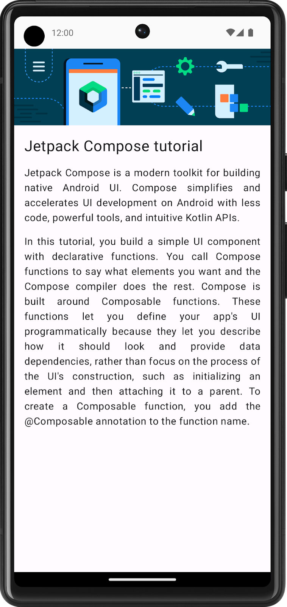

# Compose_article
### The Learn Together app displays a list of articles about several Jetpack libraries. Users can choose the topic of their choice and learn about its latest developments.

#### this app is only made for learning purposes in which i learnt about
* column
* modifiers
* Image composables
* String Resource Management
  
